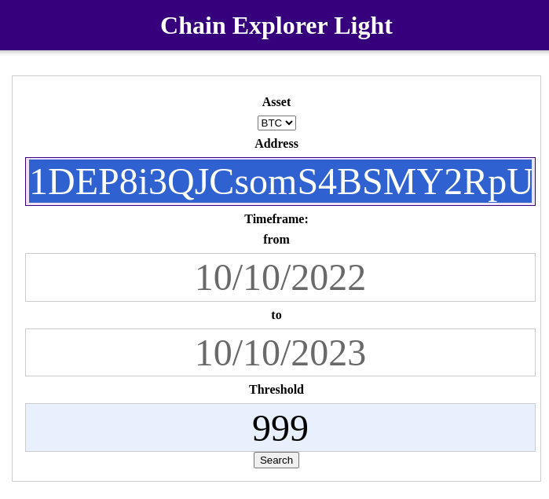

For deploying docker run:
sudo docker compose up -d
OR
docker compose up -d

For some reasons the following command now can't be run in the Dockerfile:
RUN echo "127.0.0.1 www.my.crypto.com my.crypto.com" >> /etc/hosts

so we need to run:
sudo docker exec -u root -it mycryptocom-webserver-1 bash

and put in /etc/hosts the line:
127.0.0.1 www.my.crypto.com my.crypto.com

composer install

bin/console doctrine:schema:create

CLI connection to the database "crypto" is:
mysql --host=127.0.0.1 --port=33066 --user=root --password=arthur --database=crypto

the site is located at:
http://127.0.0.1:8086/

Just in case any weird permissions issues we can set up:
sudo chmod -R 775 my.crypto.com

composer install

format of a date has to be    ->  10/10/2022
a valid address can be -> 1DEP8i3QJCsomS4BSMY2RpU1upv62aGvhD

